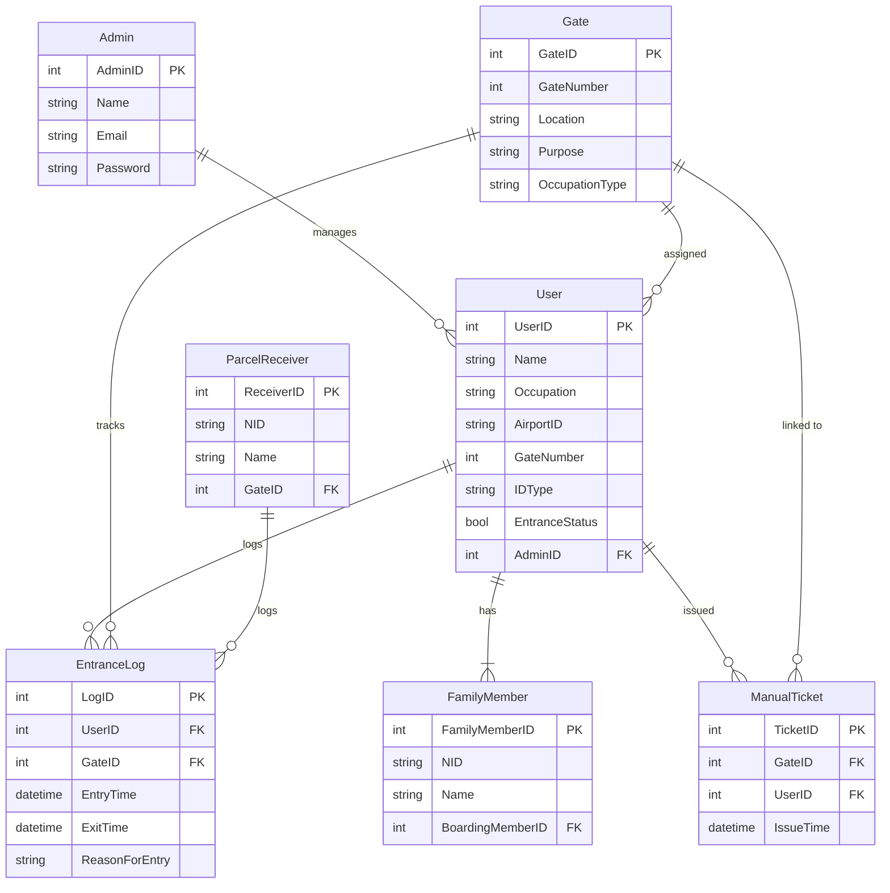

# International Airport Management System

## Screenshots

### Passenger Management UI


### Flight Dashboard


### Animated Demo
<video controls autoplay muted loop style="max-width: 100%;">
  <source src="Devfiles/Assets/an.mp4" type="video/mp4">
  Your browser does not support the video tag.
</video>


## Welcome Message
<p align="center">
  <a href="https://git.io/typing-svg">
    
  </a>
</p>

<a target="_blank" rel="noopener noreferrer nofollow" href="https://raw.githubusercontent.com/rakibhassan66/rakibhassan66/output/github-contribution-grid-snake-dark.svg">
  
</a>

---

## Overview
The **International Airport Management System** is a database-driven project designed to manage airport operations effectively. This project implements features like passenger management, ticket booking, flight scheduling, employee tracking, and more using MySQL. The code is optimized for use with XAMPP and provides detailed triggers, stored procedures, and views for operational efficiency.

## Features
- **Passenger Management**: Store and manage passenger information.
- **Flight Scheduling**: Track flights with departure and arrival details.
- **Ticket Booking**: Book and manage tickets for passengers.
- **Triggers and Procedures**: Automate tasks like updating flight statuses.
- **Custom Views**: Generate detailed reports on passengers and flights.

---

## Installation Guide

### Prerequisites
- **XAMPP**: Ensure XAMPP is installed and running.
- **MySQL**: Use phpMyAdmin or MySQL CLI.

### Steps to Use

1. **Clone the Repository**
   ```bash
   git clone https://github.com/yourusername/airport-management-system.git
   cd airport-management-system
   ```
   ```bash
   Make sure you have connected with your PHP file otherwise, you can't play the server it's a pre-fetch SQL So you have to make it based on tour pc Confiq and assessment
   ```

2. **Set Up the Database**
   - Open **phpMyAdmin** by navigating to `http://localhost/phpmyadmin`.
   - Create a new database named `AirportManagement`.
   - Import the provided SQL file:
     - Go to the **Import** tab.
     - Choose the SQL file from the repository (`airport_management.sql`).
     - Click **Go** to execute.

3. **Verify the Database**
   - Ensure tables are created correctly.
   - Check inserted sample data by running queries in the SQL tab of phpMyAdmin.

4. **Run the Project**
   - Use tools like MySQL Workbench or phpMyAdmin to interact with the database.
   - Run the provided stored procedures, triggers, and views to explore functionality.

---

## Project Structure

```plaintext
.
|-- airport_management.sql       # SQL script with database schema and data
|-- README.md                    # Project details (this file)
|-- assets                       # Assets for animation/UI
    |-- animation.gif
    |-- screenshot1.png
    |-- screenshot2.png
```

---

## Usage

### Stored Procedure Example
```sql
CALL GetPassengerDetails(1);
```
This procedure fetches details of the passenger with ID `1`.

### Trigger Example
Insert a new ticket to see the flight status update automatically:
```sql
INSERT INTO Tickets (TicketID, FlightID, PassengerID, SeatNumber, Class, BookingStatus)
VALUES (3, 101, 2, '14A', 'Economy', 'Confirmed');
```
Check the `Flights` table to confirm the status update.

### View Example
Fetch passenger and flight details:
```sql
SELECT * FROM PassengerFlights;
```

---

## Entity-Relationship Diagram

### Explanation of the Diagram
- **Entities and Fields**: Each box represents an entity (table) with primary keys (PK) and foreign keys (FK) indicated.
- **Relationships**:
  - **Admin** manages multiple **Users**.
  - **User** has multiple **EntranceLog** entries.
  - **Gate** can have multiple **EntranceLog** entries and is assigned to **Users** based on their role or purpose.
  - **FamilyMember** relates to a **User** as one boarding member per family.
  - **ParcelReceiver** logs specific to parcel gate entries.
  - **ManualTicket** is issued per **User** and linked to a specific **Gate**.



---

## Contribution Guidelines
1. Fork the repository and create a new branch.
2. Submit a pull request with detailed descriptions of changes.
3. Ensure all new features are tested.

---

## License
This project is licensed under the MIT License. See the `LICENSE` file for details.

---

## Contact
For issues or contributions, contact:
- **Author**: Rakib Hassan
- **Email**: rakibhassan.rh66@protonmail.com
- **Contact** https://bio.link/rakibhassan66
