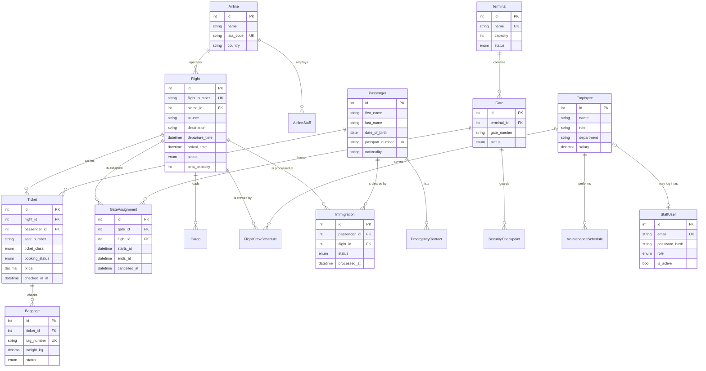

# International Airport Management System

A backend for international airport operations — flight scheduling, ticketing,
gate assignment, baggage tracking and immigration — built on FastAPI and
PostgreSQL.

<p align="center">
  <a href="https://git.io/typing-svg">
    
  </a>
</p>

---

## What's here

| Path | What it is |
|---|---|
| **`backend/`** | **The application.** FastAPI + PostgreSQL, 29 endpoints, 105 tests. Start here → [`backend/README.md`](backend/README.md) |
| `Devfiles/` | Earlier prototypes, kept for history. See [Project history](#project-history). |

---

## Quick start

```bash
cd backend
cp .env.example .env      # set POSTGRES_PASSWORD and AIRPORT_JWT_SECRET
docker compose up -d
docker compose exec api python -m app.seed
```

API on <http://localhost:8000>, interactive docs at <http://localhost:8000/docs>.

Full setup, configuration and architecture notes: [`backend/README.md`](backend/README.md).

---

## Screenshots

### Passenger Management UI


### Flight Dashboard


> These show the earlier prototype interface. The current backend is an API and
> ships no UI of its own; it serves interactive documentation at `/docs`.

---

## Features

- **Flight scheduling** — flights with a real lifecycle; illegal status jumps are rejected.
- **Ticketing** — seat allocation that cannot double-book a seat, even under concurrent requests.
- **Gate management** — a gate cannot host two flights at overlapping times.
- **Baggage tracking** — tagged bags tied to a ticket, with an enforced lifecycle.
- **Immigration** — cases for ticketed passengers, decided once.
- **Staff authentication** — argon2 password hashing, JWT access/refresh tokens, role-based access.

What makes these more than CRUD: they are enforced *in PostgreSQL* — partial
unique indexes, GiST exclusion constraints, `CHECK` constraints and row locking
— not merely checked in application code. An application-level check loses to two
simultaneous requests. [The details are here.](backend/README.md#the-rules-this-api-actually-enforces)

---

## Data model

Core operational entities. The schema has 27 tables in total; the remainder are
reference tables (fuel stations, lounges, parking, lost and found, duty free,
hotel reservations, taxis, weather, emergency protocols and contacts).


```mermaid
erDiagram
    Airline ||--o{ Flight : operates
    Airline ||--o{ AirlineStaff : employs
    Flight  ||--o{ Ticket : carries
    Flight  ||--o{ GateAssignment : "is assigned"
    Flight  ||--o{ Cargo : loads
    Flight  ||--o{ FlightCrewSchedule : "is crewed by"
    Flight  ||--o{ Immigration : "is processed at"
    Passenger ||--o{ Ticket : books
    Passenger ||--o{ Immigration : "is cleared by"
    Passenger ||--o{ EmergencyContact : lists
    Ticket  ||--o{ Baggage : checks
    Terminal ||--o{ Gate : contains
    Gate    ||--o{ GateAssignment : hosts
    Gate    ||--o{ SecurityCheckpoint : guards
    Employee ||--o{ MaintenanceSchedule : performs
    Employee ||--o{ FlightCrewSchedule : serves
    Employee |o--o| StaffUser : "may log in as"

    Airline {
        int id PK
        string name
        string iata_code UK
        string country
    }
    Flight {
        int id PK
        string flight_number UK
        int airline_id FK
        string source
        string destination
        datetime departure_time
        datetime arrival_time
        enum status
        int seat_capacity
    }
    Passenger {
        int id PK
        string first_name
        string last_name
        date date_of_birth
        string passport_number UK
        string nationality
    }
    Ticket {
        int id PK
        int flight_id FK
        int passenger_id FK
        string seat_number
        enum ticket_class
        enum booking_status
        decimal price
        datetime checked_in_at
    }
    Terminal {
        int id PK
        string name UK
        int capacity
        enum status
    }
    Gate {
        int id PK
        int terminal_id FK
        string gate_number
        enum status
    }
    GateAssignment {
        int id PK
        int gate_id FK
        int flight_id FK
        datetime starts_at
        datetime ends_at
        datetime cancelled_at
    }
    Baggage {
        int id PK
        int ticket_id FK
        string tag_number UK
        decimal weight_kg
        enum status
    }
    Immigration {
        int id PK
        int passenger_id FK
        int flight_id FK
        enum status
        datetime processed_at
    }
    StaffUser {
        int id PK
        string email UK
        string password_hash
        enum role
        bool is_active
    }
    Employee {
        int id PK
        string name
        string role
        string department
        decimal salary
    }
```

`(flight_id, seat_number)` is unique across live bookings, and
`(gate_id, [starts_at, ends_at))` cannot overlap for a gate — both enforced by
the database.

---

## Project history

`Devfiles/` holds the original prototypes. They are superseded by `backend/` and
are kept only as a record of where the project started:

- **`Airport Entrance Management Java files/`** — a NetBeans console app storing
  people in an in-memory list that was lost on exit.
- **`WEB and SQL/`** — `Main_databse.sql` (a 25-table schema, now ported and
  corrected in `backend/alembic/`) plus `webfile.html`, a page with inline PHP.
- **`Batchfile/`** — a small C utility.

The prototype PHP connected as `root` with an empty password and built SQL by
concatenating request input. **Do not deploy anything under `Devfiles/`.** The
backend addresses both issues; see
[Security notes](backend/README.md#security-notes).

For what specifically changed between `Main_databse.sql` and the shipped schema —
missing foreign keys, client-supplied primary keys, absent constraints — see
[the comparison table](backend/README.md#how-this-schema-differs-from-devfilesweb-and-sqlmain_databsesql).

---

## Contributing

1. Fork and branch.
2. `cd backend && python -m pytest` — keep it green, add tests for new behaviour.
3. `python -m ruff check app tests` before opening a PR.

---

## License

MIT. See [`LICENSE`](LICENSE).

## Contact

- **Author**: Rakib Hassan
- **Email**: rakibhassan.rh66@protonmail.com
- **Links**: https://bio.link/rakibhassan66
