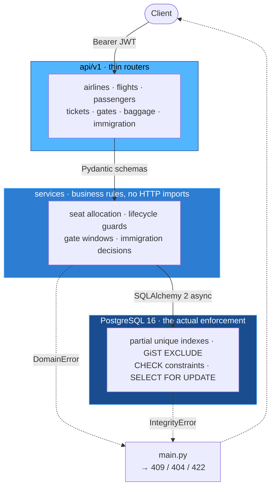
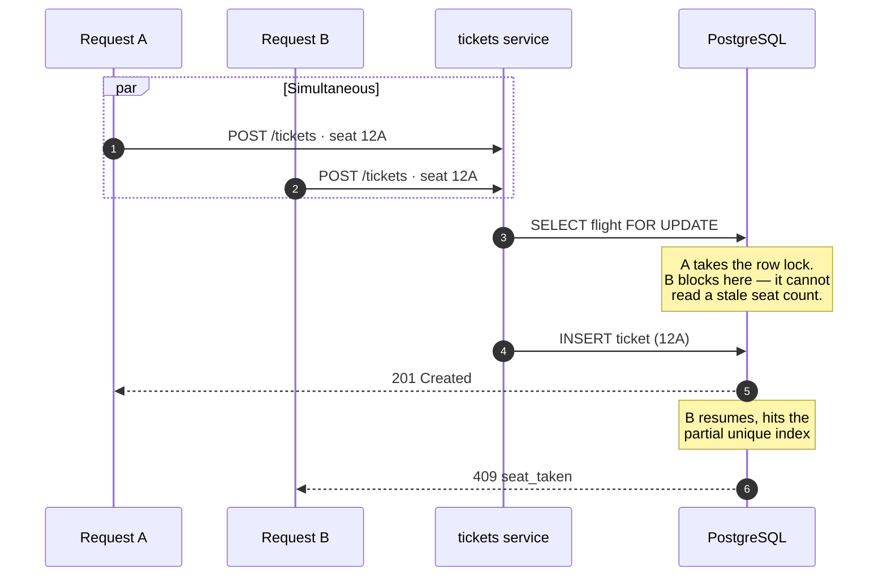
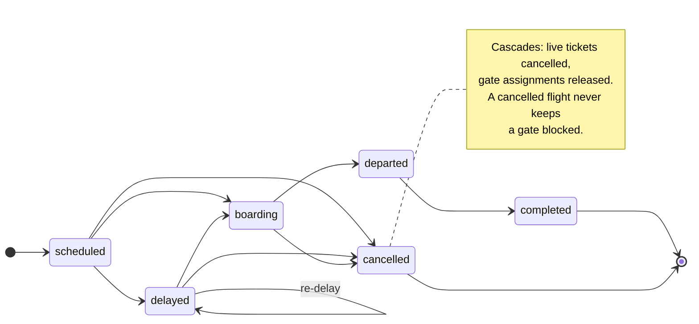
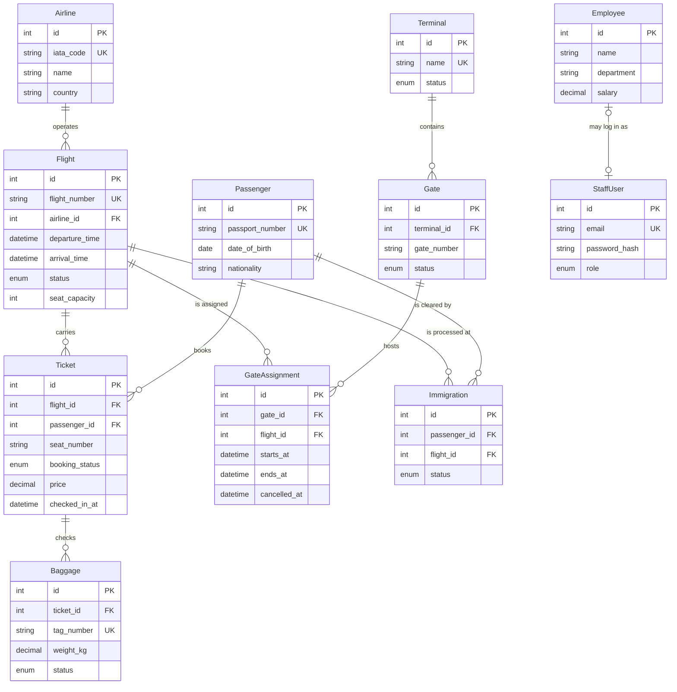
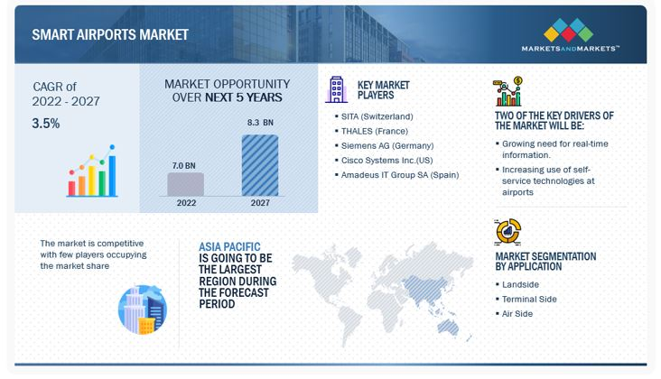

<p align="center">
  <a href="https://readme-typing-svg.demolab.com">
    
  </a>
</p>

<p align="center">
  
  
  
  
</p>

<p align="center">
  
  
  
  
</p>

<p align="center">
  <b><a href="https://airport-entrance-management-system.onrender.com/docs">▶ Try the live API →</a></b><br/>
  <sub>Swagger UI, live. Log in with <code>admin@airport.example.com</code> / <code>AirportDemo2026!</code><br/>
  Free instance — the first request may take ~50s to wake.</sub>
</p>

---

A backend for international airport operations. The interesting part is not that
it has endpoints — it is that **the rules survive concurrency**, because they are
enforced in PostgreSQL rather than checked in Python.

An application-level check loses to two simultaneous requests. In this domain
that means two passengers in seat 12A.

```python
# The check that does not work, and is everywhere:
if seat_is_free(flight, "12A"):     # ← both requests read "free"
    book(flight, "12A")             # ← both proceed
```

```sql
-- What this project does instead. One request gets 409. Always.
CREATE UNIQUE INDEX uq_tickets_flight_seat_active ON tickets (flight_id, seat_number)
  WHERE booking_status IN ('confirmed', 'checked_in');
```

---

## Quick start

```bash
cd backend
cp .env.example .env      # set POSTGRES_PASSWORD and AIRPORT_JWT_SECRET
docker compose up -d
docker compose exec api python -m app.seed
```

API on <http://localhost:8000> · interactive docs at <http://localhost:8000/docs>

<sub>Windows: use `python run_local.py`, not `uvicorn` directly — psycopg's async driver cannot run on the default ProactorEventLoop.</sub>

---

## Deploy

<p align="center">
  <a href="https://render.com/deploy?repo=https://github.com/rakibhassanrh66/Airport-Entrance-Management-System">
    
  </a>
</p>

Already deployed at the link above. `render.yaml` provisions the database and
web service together and wires the connection string. **Render is the
recommended target** — it builds `backend/Dockerfile` as-is, so what runs in
production is the artifact that runs locally.

Vercel is supported too (`vercel.json` + `api/index.py`), but it costs you the
Dockerfile, in-process migrations, and connection pooling. The trade is spelled
out in **[docs/DEPLOY.md](docs/DEPLOY.md)** — read it before choosing.

Showing this to someone? **[docs/DEMO.md](docs/DEMO.md)** has the script.

> The app has **no fallback secrets by design**. Without `AIRPORT_DATABASE_URL`
> and `AIRPORT_JWT_SECRET` it refuses to boot rather than starting insecure.

---

## Architecture

Business rules live in `services/`, which imports no HTTP. Routers are thin and
translate; the database has the final say.


```mermaid
flowchart TD
    C(["Client"]) -->|"Bearer JWT"| R

    subgraph API["api/v1 · thin routers"]
        R["airlines · flights · passengers<br/>tickets · gates · baggage · immigration"]
    end

    R -->|"Pydantic schemas"| S

    subgraph SVC["services · business rules, no HTTP imports"]
        S["seat allocation · lifecycle guards<br/>gate windows · immigration decisions"]
    end

    S -->|"SQLAlchemy 2 async"| DB

    subgraph PG["PostgreSQL 16 · the actual enforcement"]
        DB["partial unique indexes · GiST EXCLUDE<br/>CHECK constraints · SELECT FOR UPDATE"]
    end

    S -.->|"DomainError"| H["main.py<br/>→ 409 / 404 / 422"]
    H -.-> C
    DB -.->|"IntegrityError"| H

    style PG fill:#1a4d8f,stroke:#52b6ff,color:#fff
    style SVC fill:#2d7dd2,stroke:#52b6ff,color:#fff
    style API fill:#52b6ff,stroke:#1a4d8f,color:#000
```

<details>
<summary><b>Why services never import FastAPI</b></summary>

<br/>

The service layer raises domain exceptions — `ConflictError`,
`IllegalStateTransitionError` — and `main.py` translates them into HTTP
responses. Business logic is therefore testable without a request cycle, and a
rule cannot quietly acquire a dependency on the transport that happens to carry
it today.

</details>

---

## The rules it enforces

### One seat, one passenger

Two bookings for 12A race. Only one wins — and it is Postgres, not Python, that
decides.


```mermaid
sequenceDiagram
    autonumber
    participant A as Request A
    participant B as Request B
    participant S as tickets service
    participant PG as PostgreSQL

    par Simultaneous
        A->>S: POST /tickets · seat 12A
        B->>S: POST /tickets · seat 12A
    end

    S->>PG: SELECT flight FOR UPDATE
    Note over PG: A takes the row lock.<br/>B blocks here — it cannot<br/>read a stale seat count.
    S->>PG: INSERT ticket (12A)
    PG-->>A: 201 Created

    Note over PG: B resumes, hits the<br/>partial unique index
    PG-->>B: 409 seat_taken
```

Cancelled tickets fall outside the index, so a released seat resells. Capacity
is guarded by the `FOR UPDATE` lock, so two callers cannot both read
"179 of 180 sold" and both proceed.

### Flights follow a lifecycle

Drawn from `FLIGHT_STATUS_TRANSITIONS` in
[`enums.py`](backend/app/models/enums.py) — including the two edges people miss:
`scheduled` may go **straight to boarding** (no delay required), and a delayed
flight may be **delayed again**.


```mermaid
stateDiagram-v2
    direction LR
    [*] --> scheduled

    scheduled --> boarding
    scheduled --> delayed
    delayed --> delayed : re-delay
    delayed --> boarding
    boarding --> departed
    departed --> completed

    scheduled --> cancelled
    delayed --> cancelled
    boarding --> cancelled

    completed --> [*]
    cancelled --> [*]

    note right of cancelled
        Cascades: live tickets cancelled,
        gate assignments released.
        A cancelled flight never keeps
        a gate blocked.
    end note
```

Anything absent is rejected with `409 illegal_state_transition`, and the
response lists which transitions *are* legal.

### One gate, one flight at a time

```sql
EXCLUDE USING gist (gate_id WITH =, tstzrange(starts_at, ends_at) WITH &&)
  WHERE (cancelled_at IS NULL)
```

Overlapping windows on a gate are impossible. Adjacent ones (10:00–11:00, then
11:00–12:00) are fine — `tstzrange` is half-open.

<details>
<summary><b>Baggage and immigration</b></summary>

<br/>

**Baggage hangs off `ticket_id`**, not `(passenger_id, flight_id)`. A bag for a
passenger never booked on the flight is *unrepresentable*, rather than merely
discouraged. Bags may be declared lost from any live state — and a lost bag can
still be delivered, because that is what happens in real airports.

**Immigration** cases open only for a passenger holding a live ticket on that
flight, and are decided exactly once.

</details>

---

## Data model

27 tables. The core operational entities:


```mermaid
erDiagram
    Airline ||--o{ Flight : operates
    Flight  ||--o{ Ticket : carries
    Flight  ||--o{ GateAssignment : "is assigned"
    Flight  ||--o{ Immigration : "is processed at"
    Passenger ||--o{ Ticket : books
    Passenger ||--o{ Immigration : "is cleared by"
    Ticket  ||--o{ Baggage : checks
    Terminal ||--o{ Gate : contains
    Gate    ||--o{ GateAssignment : hosts
    Employee |o--o| StaffUser : "may log in as"

    Airline {
        int id PK
        string iata_code UK
        string name
        string country
    }
    Flight {
        int id PK
        string flight_number UK
        int airline_id FK
        datetime departure_time
        datetime arrival_time
        enum status
        int seat_capacity
    }
    Passenger {
        int id PK
        string passport_number UK
        date date_of_birth
        string nationality
    }
    Ticket {
        int id PK
        int flight_id FK
        int passenger_id FK
        string seat_number
        enum booking_status
        decimal price
        datetime checked_in_at
    }
    GateAssignment {
        int id PK
        int gate_id FK
        int flight_id FK
        datetime starts_at
        datetime ends_at
        datetime cancelled_at
    }
    Baggage {
        int id PK
        int ticket_id FK
        string tag_number UK
        decimal weight_kg
        enum status
    }
    Immigration {
        int id PK
        int passenger_id FK
        int flight_id FK
        enum status
    }
    Terminal {
        int id PK
        string name UK
        enum status
    }
    Gate {
        int id PK
        int terminal_id FK
        string gate_number
        enum status
    }
    Employee {
        int id PK
        string name
        string department
        decimal salary
    }
    StaffUser {
        int id PK
        string email UK
        string password_hash
        enum role
    }
```

<sub>The remaining tables are reference data: fuel stations, lounges, parking, lost and found, duty free, hotel reservations, taxis, weather, emergency protocols and contacts.</sub>

`(flight_id, seat_number)` is unique across live bookings, and
`(gate_id, [starts_at, ends_at))` cannot overlap. Both enforced by the database.

---

## API

**35 endpoints** under `/api/v1`. Full reference at `/docs`.

| Area | Highlights |
|---|---|
| **auth** | `login`, `refresh`, `me`, `staff` <sub>(admin)</sub> |
| **flights** | list/filter, create, `PATCH /{id}/status`, `GET /{id}/seats` |
| **tickets** | book, `check-in`, `cancel` |
| **passengers** | register, search by name/nationality |
| **gates** | terminals, gates, `gate-assignments`, `GET /gates/{id}/schedule` |
| **baggage** | check in, `by-tag/{tag}`, `PATCH /{id}/status` |
| **immigration** | open case, `POST /{id}/decision` |

Liveness at `/health` <sub>(no database)</sub> · readiness at `/ready` <sub>(checks the database)</sub>

<details>
<summary><b>Roles</b></summary>

<br/>

| Role | May do |
|---|---|
| `admin` | everything |
| `ops` | airlines, flights, terminals, gates, assignments |
| `checkin` | passengers, tickets, check-in, baggage |
| `security` | immigration cases and decisions |

argon2 hashing, transparently rehashed when parameters change. Refresh tokens
are accepted **only** by `/auth/refresh` and rejected everywhere else.

</details>

<details>
<summary><b>Known gaps — read before exposing to real traffic</b></summary>

<br/>

- **No logout / refresh-token revocation.** A stolen token is valid until it expires.
- **No login rate limiting.**
- **No CI pipeline.**
- **17 tables are modelled and migrated but have no HTTP routes** — employees,
  cargo, crew scheduling, runways, maintenance, checkpoints, airline staff, and
  the 10 reference tables. Deliberate: quality over surface area.

</details>

---

## Tests

```bash
cd backend && python -m pytest
```

105 tests, against **real PostgreSQL** — created, migrated and dropped
automatically. Not SQLite: partial unique indexes, GiST exclusion constraints and
`SELECT … FOR UPDATE` do not exist there, so a green SQLite suite would prove
nothing about production. Each test runs in a transaction that is rolled back.

Included is a test that fires two concurrent bookings at one seat and asserts
exactly one wins.

---

## Screenshots

<p align="center">
  
  
</p>

> These are the **earlier prototype's** interface. The current backend is an API
> and ships no UI of its own; it serves interactive documentation at `/docs`.

---

## Project history

<details>
<summary><b><code>Devfiles/</code> — where this started</b></summary>

<br/>

Kept as a record, superseded by `backend/`.

| | |
|---|---|
| **`Airport Entrance Management Java files/`** | A NetBeans console app. People lived in an in-memory list, lost on exit. |
| **`WEB and SQL/`** | `Main_databse.sql` — a 25-table schema, now ported and corrected in `backend/alembic/` — plus `webfile.html`, a page with inline PHP. |
| **`Batchfile/`** | A small C utility. |

The prototype PHP connected as `root` with an empty password and built SQL by
concatenating request input. **Do not deploy anything under `Devfiles/`.**

The Java has since had its genuine defects repaired — a contact number stored as
`int` silently dropped the leading zero from `01712345678`, and three separate
`Scanner`s over `System.in` fought over one buffer. See
[Security notes](backend/README.md#security-notes) and
[the schema comparison](backend/README.md#how-this-schema-differs-from-devfilesweb-and-sqlmain_databsesql)
for what changed and why.

</details>

---

## Contributing

1. Fork and branch.
2. `cd backend && python -m pytest` — keep it green; add tests for new behaviour.
3. `python -m ruff check app tests` before opening a PR.

---

<p align="center">
  <b>Rakib Hassan</b><br/>
  <a href="mailto:rakibhassan.rh66@protonmail.com">rakibhassan.rh66@protonmail.com</a> ·
  <a href="https://bio.link/rakibhassan66">bio.link/rakibhassan66</a><br/>
  <sub>MIT licensed — see <a href="LICENSE">LICENSE</a></sub>
</p>


